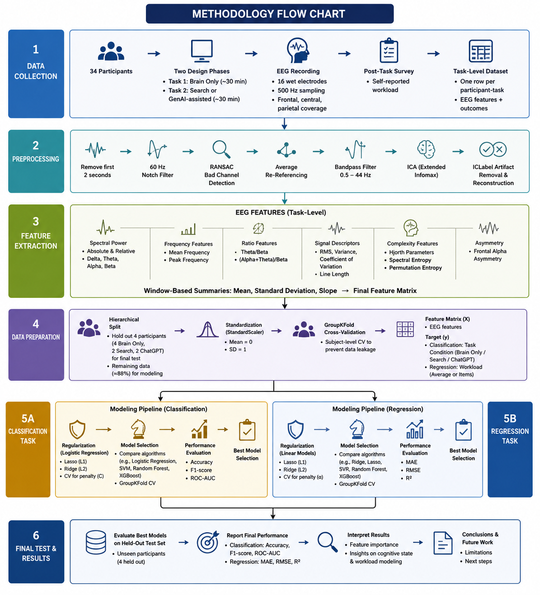

# EEG-Based-Modeling-of-Cognitive-State-and-Workload-in-an-Architectural-Design-
Machine learning analysis of EEG-derived features during architectural design tasks, focusing on classification of task conditions and regression of self-reported cognitive workload in a small-sample dataset.

# Methodology

## 📊 Results

The strongest result was obtained for the **binary classification of ChatGPT-assisted vs. non-AI design tasks**. Initial models showed substantial overfitting, with testing accuracies of approximately **45–53%**. After reducing the feature space and focusing on frontal EEG activity, model generalization improved considerably.

### Classification Results

The final **Random Forest classifier** used only two EEG features:

- **Frontal θ/β slope**
- **Frontal (α+θ)/β slope**

Using subject-specific scaling, the final model achieved:

| Metric | Accuracy |
|---|---:|
| Training Accuracy | **95.8%** |
| Testing Accuracy | **86.7%** |
| Held-out Participant Accuracy | **87.5%** |

When evaluated on completely held-out participants, the model achieved **87.5% accuracy**, although the final test set contained only four participants.

These results suggest that changes in **frontal EEG activity over the full design session** may contain useful information for distinguishing AI-assisted from non-AI design conditions.

  

  <em>Classification performance improved substantially after feature reduction and selection of frontal EEG features.</em>

### Workload Regression Results

The **workload regression task produced substantially weaker results**. PCA was used to reduce the high-dimensional EEG feature space, followed by comparison of several regression models including Ridge, Lasso, Elastic Net, Support Vector Regression (SVR), and Random Forest.

The best-performing model for the **Search/ChatGPT task** was SVR:

| Metric | Value |
|---|---:|
| Cross-validation R² | **−0.057** |
| Test R² | **−0.223** |

The negative R² values indicate that the regression models did **not generalize reliably to unseen participants**. Performance for the Brain-Only task was even weaker, suggesting that the available EEG features were insufficient for reliable prediction of self-reported workload in the current small-sample dataset.

### 🔑 Key Takeaway

> **EEG features showed promising predictive information for distinguishing ChatGPT-assisted from non-AI design conditions, but the available data did not support reliable prediction of self-reported cognitive workload.**

The classification results indicate that a small set of **frontal EEG features** may capture useful differences between AI-assisted and non-AI design conditions. However, because of the small dataset—particularly the limited held-out test sample—these findings should be interpreted as **preliminary evidence rather than definitive proof of generalizable EEG markers of AI-assisted design cognition**.
